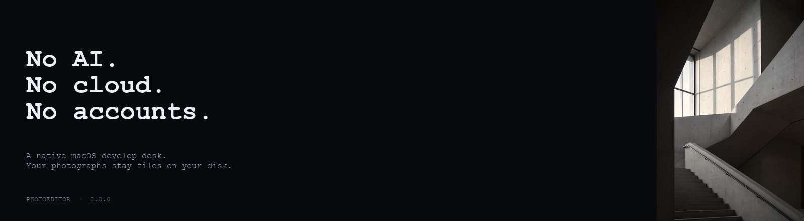
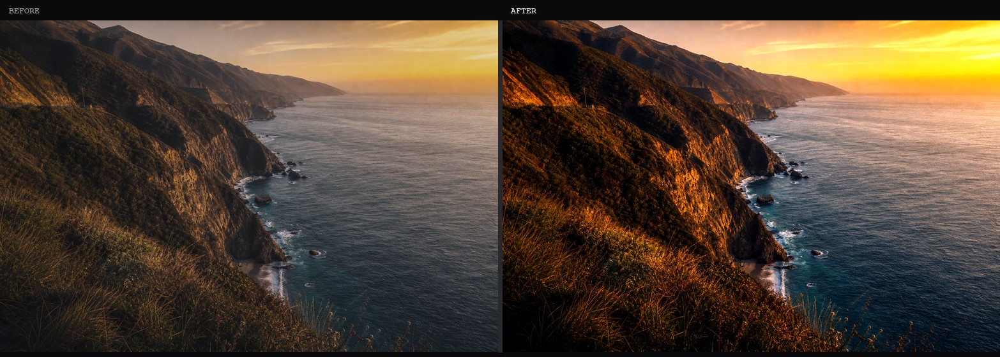
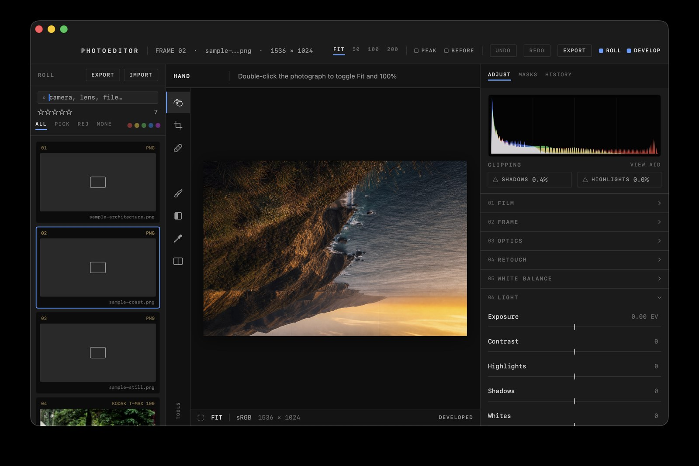
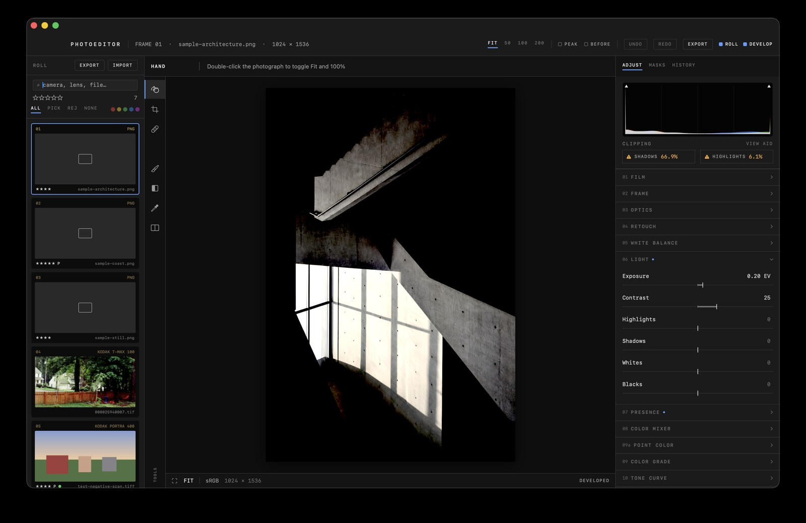
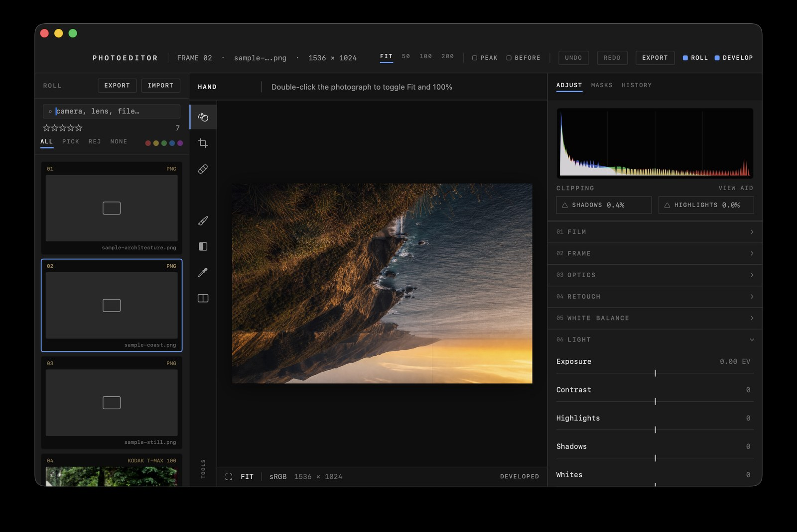

# PhotoEditor

*totally not an open source Lightroom*

<p align="center">
  
</p>

**No AI. No cloud. No accounts.** A native macOS develop desk for people who still want their photographs to be files.

Non-destructive from the ground up: originals are never modified. Every edit is a small JSON description replayed through a GPU filter chain — from the live Metal preview to the final export. Built with SwiftUI and Core Image, with a GRDB/SQLite catalog you can open in `sqlite3`.

[Download 2.0.0](https://github.com/ajaiupadhyaya/totallynotanopensourcelightroom/releases/latest) · macOS 14+ · Developer ID signed & notarized

---

<p align="center">
  
</p>

## See it

<p align="center">
  
</p>

<p align="center"><em>The photograph is the only picture on screen. Everything else is annotation.</em></p>

<p align="center">
  
</p>

<p align="center">
  
</p>

---

## The design

The interface is drawn from scratch — no stock macOS controls in the editor. One monospaced voice, like the title block of an architectural drawing or the engraved fascia of a darkroom instrument:

- **Faders, not sliders** — a hairline baseline, a tick at neutral, a quiet bar to the needle. What you have done to a photo is visible as a length. Drag the track; hold **⌥** for 10× finer motion; drag the readout to scrub; double-click to reset.
- **A numbered signal chain** — sections are numbered in the order the render pipeline actually runs (`01 FILM` … `13 EFFECTS`). The numbers are a legend, not decoration.
- **The filmstrip is a film rebate** — frame numbers and stock names edge-printed in dim amber, the way a negative carries its own provenance.
- **Achromatic chrome** — every interface gray has R = G = B exactly, so the surround never shifts perceived white balance. Color appears only where it carries photographic meaning.

---

## Film, first

<p align="center">
  
</p>

Scanned negatives are a first-class subject, not a plugin afterthought. Film conversion is stage `01` in the numbered chain:

- **Negative conversion** — divide out the film base, invert, rebalance in a single GPU pass. The math runs where scans actually live; inverting in linear light is what makes conversions look harsh.
- **Film base sampling** — automatic, or click the border with the eyedropper.
- **Stock profiles** — starting points for common C-41, ECN-2, B&W, and slide stocks, honestly labeled as approximations. The reliable path is **calibration**: sample *your* base from *your* scanner and save the whole chain.
- **Stock matching** — ranks candidates by base chromaticity. It separates color negative from B&W from slide; within C-41 it presents candidates, not identifications.

---

## Develop tools

**Light & presence** — exposure, contrast, highlights / shadows / whites / blacks; white balance with a click-a-neutral eyedropper; texture, clarity, dehaze, vibrance.

**Color** — 8-band HSL mixer; black & white with per-band channel mix; three-way grading; RGB and per-channel curves; **parametric tone regions**; **point color** targets; **color calibration**; imported **`.cube` looks**.

**Geometry & optics** — crop, rotate, straighten, flip; barrel / pincushion; keystone; chromatic-aberration defringe that only touches hard edges.

**Retouch** — heal, clone, and content-aware remove as spots or brush strokes, with opacity, feather, and auto source for heal.

**Masks** — composable components: brush, linear / radial gradients, luminance and colour range, on-device Vision subject / person / background / sky. Combine with add, subtract, intersect. Refine, invert, and show the selection with a red overlay (`⌘⇧M`).

**Preview** — Metal canvas with EDR on capable displays, frame coalescing while you scrub, and tiled full-resolution rendering at 100%+ zoom.

<p align="center">
  
</p>

**Library** — filmstrip culling with ratings, pick / reject, colour labels, search; virtual copies; snapshots; presets; batch export from the full-resolution original.

Tool rail shortcuts: `H` hand · `C` crop · `J` heal · `S` clone · `B` brush · `G` gradient · `I` eyedropper · `\` before / after.

---

## Install

Grab `PhotoEditor-2.0.0.zip` from the latest
[release](https://github.com/ajaiupadhyaya/totallynotanopensourcelightroom/releases/latest),
unzip, and drag `PhotoEditor.app` to `/Applications`.

The build is Developer ID signed and notarized by Apple — it opens with a normal double-click. Requires **macOS 14+**.

---

## Build from source

Requires Xcode and [XcodeGen](https://github.com/yonaskolb/XcodeGen) (`brew install xcodegen`). `project.yml` is the source of truth.

```sh
xcodegen generate
xcodebuild -project PhotoEditor.xcodeproj -scheme PhotoEditor \
  -destination 'platform=macOS' build
```

Tests (~259):

```sh
xcodebuild -project PhotoEditor.xcodeproj -scheme PhotoEditor \
  -destination 'platform=macOS' test
```

---

## Architecture notes

- `EditStack` is the whole edit state: a flat, `Codable` value stored as JSON in the catalog. Fields decode leniently, so adding a control never invalidates an existing library.
- `EditRenderer` replays a stack as a lazy `CIImage` chain in deliberate order (film conversion first — on an un-inverted negative every other slider would work backwards). Mixer, B&W, grading, calibration, point color, and channel curves collapse into one cached 32³ LUT.
- The “developed source” prefix (film, geometry, defringe, retouch) is memoized, so dragging a tone slider never re-runs a heal or a negative conversion.
- Preview uses a Metal `CIRenderDestination` path; export re-decodes the original at full resolution and replays the same stack. Masks, crops, and retouch live in unit coordinates so both paths agree.
- The catalog lives at `~/Library/Application Support/PhotoEditor/`.

---

## License

MIT — see [LICENSE](LICENSE).

<p align="center"><sub>Sample photographs in this README are synthetic stand-ins generated for documentation — not real clients, not real rolls.</sub></p>
